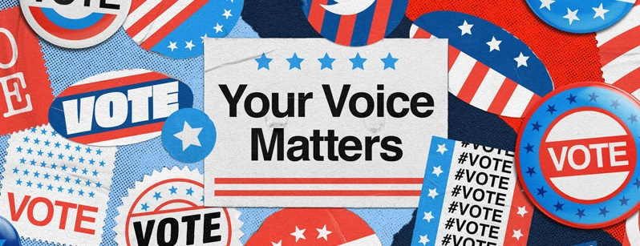

# Binary Text Classifier For EEUU Elections Tweets 2020 - DeepLearning with Tensorflow

The aim of this project is to create a Binary Text Classifier for Tweets using a DeepLearning technique with Tensorflow. The aim of this work is to classify tweets related to the USA elections 2020 to predict if a given tweet is in favor of Trump or Biden. 

To execute the code, create a virtual environment and install the requirements:

*pip install -r requirements.txt*

The code has been explained in my [personal blog](https://raulcastillabravo.blogspot.com/2020/12/binary-text-classifier-for-eeuu.html).

I have also made a web app with Flask using this DeepLearning project. You can visit the GitHub repository in this [link](https://github.com/raulcastillabravo/EEUU-Elections-Tweets-Web)
